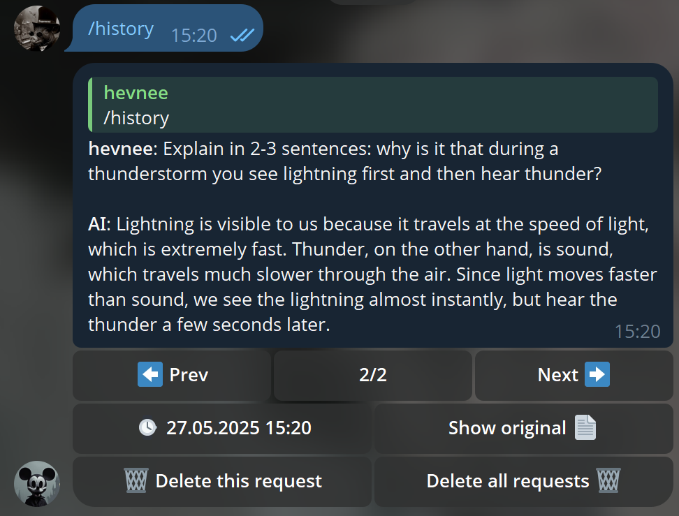

# [barchy](https://t.me/barchy_bot)

    
    
    
    

## Table of Contents

* [About](#about)
* [Screenshots](#screenshots)
* [Requirements](#requirements)
* [Setup](#setup)
* [Contributing](#contributing)
* [License](#license)

## About

barchy is a Telegram bot built with [aiogram](https://github.com/aiogram/aiogram/), designed to interact with users and provide AI-driven responses. It leverages [LibreTranslate](https://libretranslate.com/) for translation services and is optimized for Windows environments

## Screenshots

## Requirements

* Python: 3.10 | 3.11 | 3.12
* Operating System: Windows 10/11
* Recommended PC specifications: NVIDIA graphics card with a minimum of 8GB VRAM (for weak PCs you can use gpt2)

## Setup

1. Install all libraries from the `requirements.txt`.
2. Navigate to `bot/configs/settings.py`
    * Replace `TOKEN` with your actual Telegram Bot API token.
    * Change `MODEL_NAME` to a model listed in `MODELS.md` or another model you know.
3. To use AI with other languages, you need to install [LibreTranslate repository from github](https://github.com/LibreTranslate/LibreTranslate/).
4. Run `main.py` in libretranslate.
5. Run `run.bat`.
6. Enjoy!

## Contributing

I welcome contributions to the `barchy-aiogram`! If you want to fix code, add a feature branch, or do anything else, please:
* Fork the repository.
* Create a feature branch.
* Submit a pull request with comments to understand why the project needs it.

## License

Copyright © 2025 [hevnee](https://github.com/hevnee).  
barchy is [MIT](https://choosealicense.com/licenses/mit/) licensed.